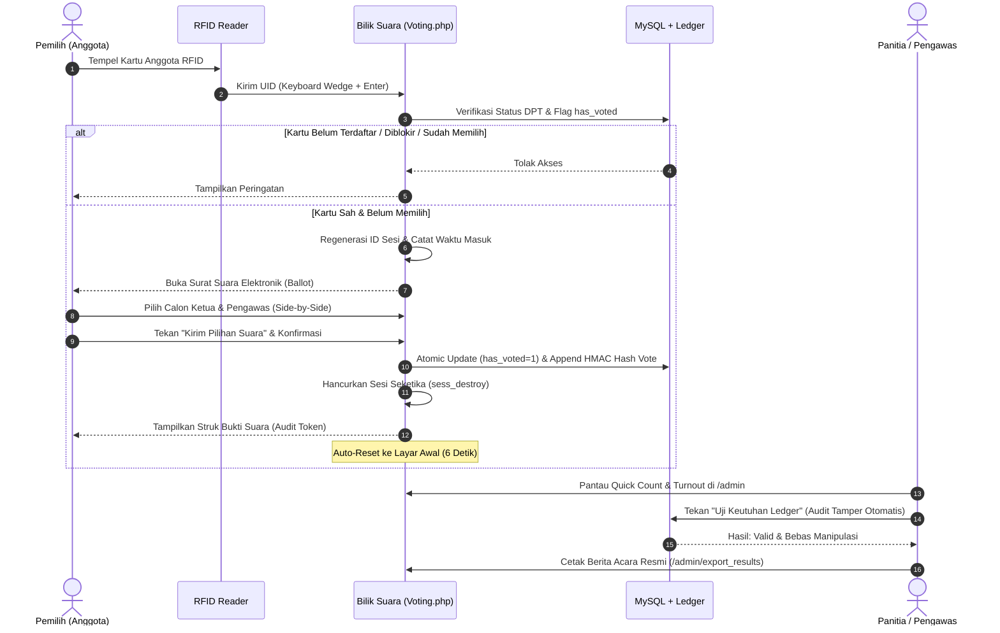

# KOPUS (Koperasi UBS) - Sistem E-Voting Berbasis RFID

[](#)
[](#)
[](#)
[](#)

**KOPUS (Koperasi UBS)** adalah sistem pemungutan suara elektronik (*E-Voting*) berbasis pembaca kartu RFID (*HID Keyboard Wedge*) yang dirancang khusus untuk pemilihan pengurus (Ketua) dan pengawas koperasi secara Langsung, Umum, Bebas, Rahasia, Jujur, dan Adil (**Luber & Jurdil**).

Sistem ini dikembangkan dengan arsitektur keamanan tingkat tinggi untuk beroperasi di lingkungan jaringan intranet korporat/koperasi, dilengkapi **Cryptographic Hash Chaining (Ledger Anti-Tamper)** untuk menjamin suara yang masuk tidak dapat dimanipulasi secara ilegal, baik oleh oknum internal melalui phpMyAdmin maupun lewat celah injeksi database.

---

## Daftar Isi

1. [Fitur Unggulan Sistem](#1-fitur-unggulan-sistem)
2. [Arsitektur Keamanan & Anti-Kecurangan](#2-arsitektur-keamanan--anti-kecurangan)
3. [Standar Desain Antarmuka & UX Kiosk](#3-standar-desain-antarmuka--ux-kiosk)
4. [Struktur Modul & Halaman](#4-struktur-modul--halaman)
5. [Persyaratan Sistem & Instalasi](#5-persyaratan-sistem--instalasi)
6. [Data Akun Default & Kartu RFID Uji Coba](#6-data-akun-default--kartu-rfid-uji-coba)
7. [Panduan Operasional Hari-H Pemilihan](#7-panduan-operasional-hari-h-pemilihan)
8. [Struktur Direktori Proyek](#8-struktur-direktori-proyek)

---

## 1. Fitur Unggulan Sistem

- **Bilik Suara Kiosk Layar Sentuh**: Antarmuka responsif ramah layar sentuh maupun keyboard/mouse dengan auto-focus tersembunyi pada reader RFID.
- **Daftar Calon Horizontal (Ke Samping)**: Berapapun jumlah kandidat (2, 3, 4, dst.), susunan kartu calon selalu tertata rapi berjejer ke samping dalam satu baris dengan navigasi *horizontal scroll* yang halus.
- **Pemisah & Diferensiasi Kategori Visual**:
  - Kolom **Ketua Koperasi**: Nuansa hijau zamrud (*Emerald Fresh*), border mint, dan tag nomor urut Amber Emas.
  - Kolom **Pengawas Koperasi**: Nuansa biru safir (*Azure Blue*), border biru, dan tag nomor urut Biru Safir.
  - Pembatas vertikal tegas (*divider*) memisahkan kedua kategori pemilihan di layar desktop/kiosk.
- **Countdown Timer Sesi Bilik Suara (120 Detik)**: Melindungi hak suara pemilih. Jika bilik suara ditinggalkan tanpa memilih, sesi otomatis dibatalkan (*auto-reset*) ke layar awal.
- **Tanda Terima Digital Anonim (Audit Token)**: Pemilih mendapatkan kode acak tanda terima (contoh: `KOP-5EEA0142`) sebagai bukti bahwa hak suaranya sah tercatat tanpa membuka rahasia kandidat pilihannya.
- **Portal Panitia & Pengawas Terpadu**:
  - Monitoring Quick Count & Turnout DPT real-time.
  - Modul audit otomatis **"Uji Keutuhan Ledger"** (Verifikasi Integritas Database).
  - Manajemen Calon: Tambah, edit, upload foto, toggle aktif/nonaktif, dan proteksi hapus jika sudah ada suara masuk.
  - Manajemen DPT: Pencarian, pendaftaran kartu RFID baru via tap, blokir/unblock anggota, dan reset hak suara darurat.
  - Cetak Berita Acara resmi hasil pemungutan suara siap tanda tangan.

---

## 2. Arsitektur Keamanan & Anti-Kecurangan

### A. Ledger Kriptografis Anti-Tamper (HMAC SHA-256 Hash Chaining)
Salah satu ancaman terbesar dalam e-voting lokal adalah **oknum atau user iseng yang memiliki akses database (phpMyAdmin / SQL Console)** dan mengubah pilihan kandidat atau menyisipkan suara palsu secara diam-diam.

KOPUS mengatasi ini dengan konsep **Blockchain-like Ledger**:
1. Setiap suara yang masuk ke tabel `votes` diikat secara kriptografis menggunakan fungsi hash **HMAC SHA-256**:
   $$\text{vote\_hash} = \text{HMAC-SHA256}(\text{previous\_hash} \parallel \text{candidate\_id} \parallel \text{created\_at} \parallel \text{receipt\_token}, \text{secret\_salt})$$
2. Suara pertama diikat ke *Genesis Hash* (`0000000000000000000000000000000000000000000000000000000000000000`). Suara berikutnya selalu menggunakan `vote_hash` dari baris sebelumnya sebagai `previous_hash`.
3. **Deteksi Manipulasi Presisi**: Mesin verifikasi di `Voting_model::verify_ledger_integrity()` merekomputasi seluruh rantai hash dari baris pertama sampai terakhir.
   - Jika ada baris yang diubah (misal `candidate_id` diedit dari 1 ke 2), sistem **seketika mendeteksi nomor baris database yang rusak** dan menandai sistem sebagai **"KECURANGAN TERDETEKSI"**.
   - Jika ada baris yang disisipkan atau dihapus di tengah, rantai hash terputus dan langsung teridentifikasi.
   - Prosedur mitigasi dan SOP penanganan saat manipulasi terdeteksi diatur lengkap di dokumen **[docs/sop-penanganan-insiden-ledger.md](docs/sop-penanganan-insiden-ledger.md)**.

### B. Mitigasi Race Condition (Anti-Double Voting)
Untuk mencegah pemilih melakukan tap kartu ganda secara cepat atau mengirimkan multiple parallel requests untuk mencoblos lebih dari sekali:
- Perekaman status memilih menggunakan **Atomic Conditional Update**:
  ```sql
  UPDATE voters 
  SET has_voted = 1, voted_at = ? 
  WHERE id = ? AND has_voted = 0 AND status = 'active'
  ```
- Sistem memeriksa nilai `affected_rows()`. Jika hasilnya bukan tepat `1`, transaksi database seketika dibatalkan (`ROLLBACK`), sehingga suara ganda mustahil tersimpan.

### C. Kepatuhan OWASP Top 10 (Intranet Corporate)
Mengacu pada panduan keahlian `owasp-security-ci3`:
- **Response Hardening**: Mengirim header `X-Content-Type-Options: nosniff`, `X-Frame-Options: DENY`, `X-XSS-Protection: 1; mode=block`, dan `Cache-Control: no-store, no-cache, must-revalidate`.
- **Intranet HTTP Exemption**: Sesuai standar LAN tertutup koperasi, header HSTS (`Strict-Transport-Security`) **tidak diaktifkan** agar tidak merusak koneksi HTTP lokal.
- **CSRF Protection**: Proteksi Cross-Site Request Forgery diaktifkan di seluruh formulir dan AJAX.
- **Cookie Security**: Sesi cookie diatur `HttpOnly = TRUE` dan `SameSite = Lax` untuk mencegah pencurian cookie sesi via JavaScript XSS.
- **RFID Rate Limiter**: Membatasi percobaan tap gagal maksimal 8 kali per 30 detik per IP untuk mencegah serangan *brute force scanner*.
- **Zero SQL String Interpolation**: Semua query ke MySQL menggunakan query binding / parameter escaping tanpa penggabungan string mentah.

---

## 3. Standar Desain Antarmuka & UX Kiosk

### A. Desain Visual KOPUS
- **Palet Warna Resmi Koperasi**:
  - *Forest Emerald* (`#0F5132`, `#166534`): Identitas utama mencerminkan koperasi yang sehat, bertumbuh, dan tepercaya.
  - *Azure & Steel Blue* (`#0284c7`, `#0369a1`): Warna penanda kategori pengawasan independen.
  - *Golden Amber* (`#D97706`): Penanda nomor urut kandidat yang kontras dan mudah dibaca.
  - *Slate Dark* (`#0F172A`) dan *Warm Surface* (`#F8FAFC`, `#FFFFFF`): Menjamin keterbacaan tinggi dan kenyamanan mata di layar monitor/kiosk.
- **Prinsip Ergonomi Bilik Suara**:
  - Tipografi bersih berbasis font sistem sans-serif modern tanpa ornamen berlebihan.
  - Elemen interaktif berukuran proporsional dan ramah sentuhan (*touch-friendly*).
  - Status visual yang jelas untuk setiap tahapan pemilihan.

### B. Struktur & Standar Penulisan Kode
- **Arsitektur Model-View-Controller (MVC)** yang terisolasi dengan tanggung jawab yang jelas.
- Dokumentasi kode yang ringkas dan terarah, berfokus pada logika keamanan, mitigasi *race condition*, dan integritas kriptografis.
- Pemisahan berkas stylesheet (`koperasi.css`) untuk memudahkan kustomisasi tema identitas koperasi di kemudian hari.

---

## 4. Struktur Modul & Halaman

### Modul Pemilih (Bilik Suara Kiosk)
| Rute URL | Tampilan | Fungsi |
|---|---|---|
| `/voting` | [scanner.php](application/views/voting/scanner.php) | Layar selamat datang, status sensor RFID, input trap otomatis |
| `/voting/ballot` | [ballot.php](application/views/voting/ballot.php) | Surat suara digital Ketua & Pengawas (horizontal layout), modal visi misi, timer 120s |
| `/voting/success` | [success.php](application/views/voting/success.php) | Tanda terima audit token kriptografis dan hitung mundur reset otomatis |

### Modul Panitia & Pengawas
| Rute URL | Tampilan | Fungsi |
|---|---|---|
| `/admin/login` | [login.php](application/views/admin/login.php) | Autentikasi panitia dan pengawas independen |
| `/admin` | [dashboard.php](application/views/admin/dashboard.php) | Rekapitulasi Quick Count, persentase DPT, tombol **Uji Keutuhan Ledger**, audit log |
| `/admin/candidates` | [candidates.php](application/views/admin/candidates.php) | CRUD Calon Ketua & Pengawas, upload foto, status aktif, proteksi hapus jika ada suara |
| `/admin/voters` | [voters.php](application/views/admin/voters.php) | Kelola DPT, cari anggota, daftarkan kartu RFID baru via tap, blokir/buka blokir, reset hak suara |
| `/admin/export_results` | [export_report.php](application/views/admin/export_report.php) | Cetak dokumen resmi Berita Acara Hasil Pemungutan Suara format PDF/Print |

---

## 5. Persyaratan Sistem & Instalasi

### Persyaratan Lingkungan:
- **Web Server**: Apache (XAMPP / Linux Apache2 dengan modul `mod_rewrite` aktif).
- **PHP Version**: PHP 7.4.x atau PHP 8.x (dengan ekstensi `mysqli`, `session`, `mbstring`, `json`).
- **Database**: MySQL 5.7+ atau MariaDB 10.3+ (InnoDB Engine).
- **Perangkat Keras**: RFID USB Reader (Keyboard Wedge Emulation / EM4100 / Mifare 13.56MHz atau sejenisnya).

### Langkah Instalasi:

1. **Letakkan Proyek di Web Server**:
   Salin direktori proyek ke folder `htdocs`:
   ```
   C:\xampp7\htdocs\vote-koperasi
   ```

2. **Migrasi Database**:
   Buka terminal/PowerShell dan jalankan script migrasi otomatis:
   ```bash
   php database/apply_migration.php
   ```
   *Atau impor secara manual file [database/migration.sql](database/migration.sql) melalui phpMyAdmin.*

3. **Konfigurasi Database** (Jika Diperlukan):
   Periksa konfigurasi koneksi database di [application/config/database.php](application/config/database.php):
   ```php
   'hostname' => 'localhost',
   'username' => 'root',
   'password' => '123456', // sesuaikan dengan password MySQL Anda
   'database' => 'vote_koperasi',
   'dbdriver' => 'mysqli',
   ```

4. **Akses Aplikasi Melalui Browser**:
   - **Bilik Suara (Kiosk Mode)**: `http://localhost:8080/vote-koperasi/voting`
   - **Portal Admin & Pengawas**: `http://localhost:8080/vote-koperasi/admin`

---

## 6. Data Akun Default & Kartu RFID Uji Coba

### Akun Panitia & Pengawas:
| Peran | Username | Password Default | Hak Akses |
|---|---|---|---|
| **Ketua Panitia** | `admin` | `admin123` | Dashboard, Manajemen Calon, DPT, Pengaturan Sesi, Berita Acara |
| **Pengawas Independen** | `pengawas` | `pengawas123` | Monitoring Quick Count, Uji Keutuhan Ledger, Audit Log, Cetak Berita Acara |

### Contoh Kartu RFID Pemilih (Seed Data):
| UID Kartu RFID | Nomor Anggota | Nama Pemilih | Status Akun | Status Suara |
|---|---|---|---|---|
| `0044 0202 2019 0505` | A-1001 | Andi Wijaya | Aktif | Belum Memilih |
| `0044 0202 2019 0512` | A-1002 | Rina Marlina | Aktif | Belum Memilih |
| `0044 0202 2019 0530` | A-1003 | Joko Susilo | Aktif | Belum Memilih |
| `0044 0202 2019 0541` | A-1004 | Dewi Lestari | Aktif | Belum Memilih |
| `0044 0202 2019 0588` | A-1005 | Bambang Hartono | Diblokir | Belum Memilih |

---

## 7. Panduan Operasional Hari-H Pemilihan



### Cara Reset Jika Terjadi Kendala Teknis:
1. **Reset Satu Pemilih**:
   - Jika kartu pemilih tidak sengaja tertap sebelum memilih atau mengalami kendala fisik di TPS, buka menu **DPT & Kartu RFID** di `/admin/voters`, klik tombol **Reset** pada anggota tersebut. Kartu langsung dapat di-tap ulang.
2. **Reset Total untuk Pemilihan Baru (Fresh Election)**:
   - Jalankan perintah: `php database/apply_migration.php` di terminal untuk mengosongkan seluruh kotak suara dan mengembalikan DPT ke status awal.

---

## 8. Struktur Direktori Proyek

```
vote-koperasi/
├── application/
│   ├── config/
│   │   ├── autoload.php       # Autoload database, session, security helpers
│   │   ├── config.php         # OWASP Hardening: CSRF, HttpOnly, Encryption Key
│   │   ├── database.php       # Konfigurasi koneksi MySQL
│   │   └── routes.php         # Pemetaan rute bilik suara & portal admin
│   ├── controllers/
│   │   ├── Admin.php          # Controller Panitia & Pengawas (CRUD calon, DPT, audit)
│   │   └── Voting.php         # Controller Bilik Suara (Tap RFID, Ballot, Submit, Receipt)
│   ├── models/
│   │   ├── Admin_model.php    # Model data admin, statistik quick count, log audit
│   │   └── Voting_model.php   # Model bilik suara, atomic lock, HMAC Ledger & Tamper Verifier
│   └── views/
│       ├── admin/
│       │   ├── candidates.php # Manajemen Calon Ketua & Pengawas
│       │   ├── dashboard.php  # Monitoring Quick Count & Widget Uji Keutuhan Ledger
│       │   ├── export_report.php # Dokumen Berita Acara Siap Cetak (Print/PDF)
│       │   ├── login.php      # Form masuk panitia & pengawas
│       │   └── voters.php     # Manajemen DPT & pendaftaran kartu RFID
│       └── voting/
│           ├── ballot.php     # Surat suara elektronik (horizontal candidate layout)
│           ├── scanner.php    # Layar tap kartu RFID (kiosk terminal)
│           └── success.php    # Layar tanda terima audit token kriptografis
├── assets/
│   ├── css/
│   │   └── koperasi.css       # Design System & tema antarmuka resmi KOPUS
│   ├── foto/                  # Avatar vektor SVG calon default
│   └── uploads/candidates/    # Direktori penyimpanan unggahan foto calon
├── database/
│   ├── apply_migration.php    # Script otomatisasi migrasi database CLI
│   └── migration.sql          # Skema database MySQL lengkap + seed data
├── docs/
│   ├── audit-keamanan.md      # Laporan Audit Keamanan OWASP Top 10
│   └── sop-penanganan-insiden-ledger.md # SOP Penanganan Kecurangan & Kerusakan Ledger
├── index.php                  # Titik masuk utama aplikasi CodeIgniter
└── README.md                  # Dokumentasi teknis lengkap proyek KOPUS
```

---

## Lisensi & Hak Penggunaan
Sistem **KOPUS (Koperasi UBS)** dikembangkan secara khusus untuk operasional koperasi internal dengan standar keamanan enterprise dan asas pemilihan Luber-Jurdil.
